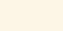

# Wire_PNG
Electrical Wire Color Codes Into PNG


**How to Use This Code**


Step 1: Set Up a Python Virtual Environment

```
python3 -m venv mycolur

source mycolur/bin/activate
```


Step 2: Clone My GitHub Repository

```
git clone "https://github.com/Tpj-root/Wire_PNG.git"
```


Step 3: Install the Required Dependencies

```
pip install -r requirements.txt
```


Step 4: Edit your code

```
    createwire('navy')         # Creates a red.png file
    createwire('red', 'black') # Creates a red_black.png file
    create_image('navy')         # Creates a red.png file
    create_image('red', 'black') # Creates a red_black.png file
```


**createwire**

Creates a png file for 80x40 size looks like a wire


| Number | Color | Output  |
| --- |  --- | --- |
| 1 |  navy |  <p>navy</p> |
| 2 |  red black |  <p>red_black</p> |


**create_image**

Creates a png file for 20x20 size looks like a square


| Number | Color | Output  |
| --- |  --- | --- |
| 1 |  navy |  <p>navy</p> |
| 2 |  red black |  <p>red_black</p> |


**Basic colurs**


```
python3 sample.py
```


| Number | Color         | Output                                              |
|--------|---------------|-----------------------------------------------------|
| 1      | black         |  <p>black</p> |
| 2      | blue          |  <p>blue</p> |
| 3      | blueviolet    |  <p>blueviolet</p> |
| 4      | brown         |  <p>brown</p> |
| 5      | burlywood     |  <p>burlywood</p> |
| 6      | chartreuse    |  <p>chartreuse</p> |
| 7      | chocolate     |  <p>chocolate</p> |
| 8      | cyan          |  <p>cyan</p> |
| 9      | darkgray      |  <p>darkgray</p> |
| 10     | darkgreen     |  <p>darkgreen</p> |
| 11     | darkred       |  <p>darkred</p> |
| 12     | deeppink      |  <p>deeppink</p> |
| 13     | deepskyblue   |  <p>deepskyblue</p> |
| 14     | dimgray       |  <p>dimgray</p> |
| 15     | dodgerblue    |  <p>dodgerblue</p> |
| 16     | firebrick     |  <p>firebrick</p> |
| 17     | forestgreen   |  <p>forestgreen</p> |
| 18     | gold          |  <p>gold</p> |
| 19     | gray          |  <p>gray</p> |
| 20     | green         |  <p>green</p> |
| 21     | hotpink       |  <p>hotpink</p> |
| 22     | indianred     |  <p>indianred</p> |
| 23     | indigo        |  <p>indigo</p> |
| 24     | khaki         |  <p>khaki</p> |
| 25     | lavender      |  <p>lavender</p> |
| 26     | lightblue     |  <p>lightblue</p> |
| 27     | lightcoral    |  <p>lightcoral</p> |
| 28     | lightgoldenrodyellow |  <p>lightgoldenrodyellow</p> |
| 29     | lightgray     |  <p>lightgray</p> |
| 30     | lightgreen    |  <p>lightgreen</p> |
| 31     | lightpink     |  <p>lightpink</p> |
| 32     | lightyellow   |  <p>lightyellow</p> |
| 33     | lime          |  <p>lime</p> |
| 34     | magenta       |  <p>magenta</p> |
| 35     | mediumblue    |  <p>mediumblue</p> |
| 36     | mediumpurple  |  <p>mediumpurple</p> |
| 37     | mediumseagreen |  <p>mediumseagreen</p> |
| 38     | mediumvioletred |  <p>mediumvioletred</p> |
| 39     | navy          |  <p>navy</p> |
| 40     | olive         |  <p>olive</p> |
| 41     | orange        |  <p>orange</p> |
| 42     | orchid        |  <p>orchid</p> |
| 43     | palegreen     |  <p>palegreen</p> |
| 44     | peru          |  <p>peru</p> |
| 45     | pink          |  <p>pink</p> |
| 46     | purple        |  <p>purple</p> |
| 47     | red           |  <p>red</p> |
| 48     | royalblue     |  <p>royalblue</p> |
| 49     | saddlebrown   |  <p>saddlebrown</p> |
| 50     | salmon        |  <p>salmon</p> |
| 51     | sandybrown    |  <p>sandybrown</p> |
| 52     | skyblue       |  <p>skyblue</p> |
| 53     | steelblue     |  <p>steelblue</p> |
| 54     | tomato        |  <p>tomato</p> |
| 55     | violet        |  <p>violet</p> |
| 56     | wheat         |  <p>wheat</p> |
| 57     | white         |  <p>white</p> |
| 58     | yellow        |  <p>yellow</p> |
| 59     | yellowgreen   |  <p>yellowgreen</p> |


```
python3 sample_2.py
```


| Number | Color             | Output                                              |
|--------|-------------------|-----------------------------------------------------|
| 1      | slateblue         |  <p>slateblue</p> |
| 2      | mediumslateblue   |  <p>mediumslateblue</p> |
| 3      | darkslateblue     |  <p>darkslateblue</p> |
| 4      | teal              |  <p>teal</p> |
| 5      | aqua              |  <p>aqua</p> |
| 6      | darkcyan          |  <p>darkcyan</p> |
| 7      | mediumaquamarine  |  <p>mediumaquamarine</p> |
| 8      | turquoise         |  <p>turquoise</p> |
| 9      | darkturquoise     |  <p>darkturquoise</p> |
| 10     | cadetblue         |  <p>cadetblue</p> |
| 11     | powderblue        |  <p>powderblue</p> |
| 12     | cornflowerblue    |  <p>cornflowerblue</p> |
| 13     | mediumspringgreen |  <p>mediumspringgreen</p> |
| 14     | springgreen       |  <p>springgreen</p> |
| 15     | seagreen          |  <p>seagreen</p> |
| 16     | lawngreen         |  <p>lawngreen</p> |
| 17     | lightseagreen     |  <p>lightseagreen</p> |
| 18     | aquamarine        |  <p>aquamarine</p> |
| 19     | mintcream         |  <p>mintcream</p> |
| 20     | honeydew          |  <p>honeydew</p> |
| 21     | beige             |  <p>beige</p> |
| 22     | ivory             |  <p>ivory</p> |
| 23     | antiquewhite      |  <p>antiquewhite</p> |
| 24     | cornsilk          |  <p>cornsilk</p> |
| 25     | linen             |  <p>linen</p> |
| 26     | bisque            |  <p>bisque</p> |
| 27     | peachpuff         |  <p>peachpuff</p> |
| 28     | oldlace           |  <p>oldlace</p> |
| 29     | snow              |  <p>snow</p> |
| 30     | seashell          |  <p>seashell</p> |
| 31     | ghostwhite        |  <p>ghostwhite</p> |
| 32     | whitesmoke        |  <p>whitesmoke</p> |
| 33     | gainsboro         |  <p>gainsboro</p> |
| 34     | floralwhite       |  <p>floralwhite</p> |
| 35     | azure             |  <p>azure</p> |
| 36     | lavenderblush     |  <p>lavenderblush</p> |
| 37     | aliceblue         |  <p>aliceblue</p> |
| 38     | rosybrown         |  <p>rosybrown</p> |
| 39     | lightsteelblue    |  <p>lightsteelblue</p> |
| 40     | silver            |  <p>silver</p> |
| 41     | plum              |  <p>plum</p> |
| 42     | crimson           |  <p>crimson</p> |
| 43     | orangered         |  <p>orangered</p> |
| 44     | darkorange        |  <p>darkorange</p> |
| 45     | palegoldenrod     |  <p>palegoldenrod</p> |
| 46     | darkkhaki         |  <p>darkkhaki</p> |
| 47     | goldenrod         |  <p>goldenrod</p> |
| 48     | navajowhite       |  <p>navajowhite</p> |
| 49     | tan               |  <p>tan</p> |
| 50     | darkgoldenrod     |  <p>darkgoldenrod</p> |
| 51     | sienna            |  <p>sienna</p> |
| 52     | maroon            |  <p>maroon</p> |
| 53     | darkslategray     |  <p>darkslategray</p> |
| 54     | dimgray           |  <p>dimgray</p> |
| 55     | lightgray         |  <p>lightgray</p> |
| 56     | whitesmoke        |  <p>whitesmoke</p> |
| 57     | chocolate         |  <p>chocolate</p> |
| 58     | saddlebrown       |  <p>saddlebrown</p> |
| 59     | salmon            |  <p>salmon</p> |
| 60     | indianred         |  <p>indianred</p> |
| 61     | tomato            |  <p>tomato</p> |
| 62     | rosybrown         |  <p>rosybrown</p> |
| 63     | palevioletred     |  <p>palevioletred</p> |


Step 5: Run the Code

```
python3 main.py
```

